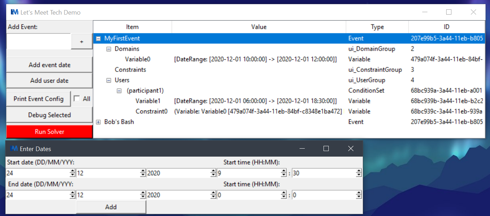

# Let's Meet Proof of Concept

This proof of concept set out to investigate the basic implementation requirements of a conditional scheduling algorithm. The goal of our concept was to implement a basic version of such an algorithm, which we were able to do. We can create an event and take in time ranges that users are available and return the time range where most people can attend.
This proves that our plan for a more sophisticated system is implementable and that it can work with conditions.

## How to run
In order to run this program, you will need Python 3 to be running on your local machine. The program has been tested with version 3.8.
You will also require the tkinter library installed and available to use (this should be preinstalled with Python 3).
Run the 'main.py' file in the first directory like you would any other Python file (from command line or IDE).

## How to use
When the program is run you will be presented with a basic GUI to interact with. The first thing that needs to be done here is creating an event. At the top of the tool bar on the left-hand side there is an input box for an events name, along with a ‘+’ button to create the event.
The ‘Print Event Config’ button in the tool bar will print a description of the event to the terminal. When using this button make sure you have an event highlighted in the right-hand side table. If we use this button at this stage, we should see that the event has no users, variables, or constraints.
As an event organiser there needs to be dates and times where the event can take place, to add these times and dates the ‘Add event date’ button is used. When clicked this will show a new window for a start date and time to be entered followed by an end date and time. This creates a range that the event can take place in, multiple of these can be added if an event can happen in more than one time range.
The above instructions apply for adding user time ranges to the event as well, through the ‘Add User Date’ button.
Once all the time ranges have been inserted, the ‘Run Solver’ button can be pressed to return the optimal event time.

## Code explanation
Solver.py is where the algorithm compares time ranges and checks if they lie within the possible event time ranges. The time ranges that are within in the possible event ranges are added to a dictionary, at the end of comparison the dictionary is checked for the entry with the most occurrences.

## Screenshots

Shown is the events overview window(top) and date entry dialog (below).